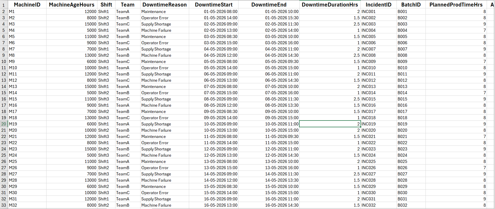
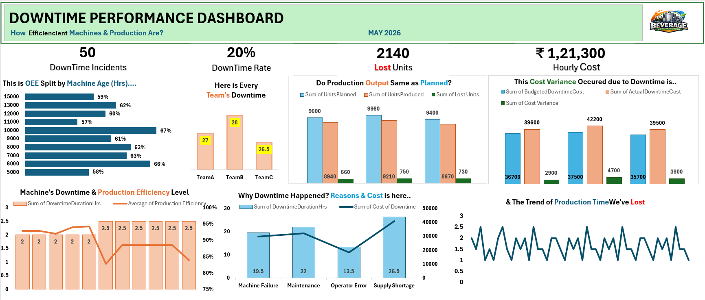

# Manufacturing Downtime Performance Analysis

**Excel dashboard analyzing machine downtime, production efficiency, and cost variance for a mid-sized fictional beverage manufacturing company.**

---

##  Project Overview
This project visualizes how machine downtime affects production output and efficiency.  
It uses manufacturing metrics to help stakeholders identify downtime causes, cost impact, and efficiency trends for better operational decisions.

---

##  Problem Statement
Frequent machine downtime leads to production loss and increased cost.  
The goal is to measure downtime rate, analyze efficiency, and highlight cost variance to improve manufacturing performance.

---

##  Dataset
- **Source:**    Maven Analytics – Manufacturing Downtime Dataset  
- **Content:**   MachineID,  MachineAgeHours,  Shift,  Team,  DowntimeReason,  DowntimeStart,  DowntimeEnd,	DowntimeDurationHrs,	IncidentID,	BatchID,	PlannedProdTimeHrs,	                  ActualProdTimeHrs,	UnitsPlanned,	UnitsProduced,	HourlyOperatingCost,	BudgetedDowntimeCost,  ActualDowntimeCost

###  Preview

---

##  Tools & Skills
- Microsoft Excel (Pivot Tables, Charts, KPI Cards)  
- Dashboard design & visualization  
- KPI identification 
- Data storytelling

---

##  Methods
- **KPIs Calculated:**  
  - Downtime Incidents  
  - Downtime Rate (%)  
  - Lost Units  
  - Hourly Cost  
- Pivot Tables for summarization    
- Dashboard layout for stakeholder review
---

##  Key Insights
- **Downtime Incidents:**  50 total with a **20% downtime rate**.  
- **Lost Production:**     2,140 units lost due to downtime.  
- **Cost Impact:**         Hourly cost reached ₹1,21,300; actual downtime cost exceeded budget by up to ₹4,700.  
- **Efficiency Trend:**  Machines aged around 10,000–8,000 hrs show highest OEE (63–67%), while older machines drop below 60%.  
- **Team Performance:**  Team B recorded the highest downtime (28 hrs).  
- **Root Causes:**  Supply shortage and maintenance are top contributors to downtime duration and cost.  
- **Production Gap:**  Actual output consistently below planned output, showing clear production inefficiency.  
- **Time Lost Trend:**  Production time loss fluctuates heavily, indicating inconsistent machine performance.

---

##  Dashboard Features
- Downtime incidents, rates (%), production Efficiency, hourly cost- **top KPIs**
- OEE (%) split by Machine age 
- Team's Performance
- Actual vs planned production
- Cost Variance- budgeted vs actual
- Machine's efficiency & downtime
- Downtime reason & cost
- Time lost trend

###  Preview

---

##  How to Use This Project
1. Download the repository.  
2. Open `Downtime_Performance_Analysis.xlsx` in Excel.  
3. Go to the Dashboard Worksheet.   
4. Review KPI cards and charts for insights.  

---

##  Result & Final Recommendations
- **Result:**  Dashboard provides a clear view of downtime patterns, efficiency levels, and cost variance.
  
- **Recommendations:**  
  - Prioritize maintenance for machines with high downtime and low efficiency.  
  - Address supply shortages to reduce downtime hours.  
  - Reassess production planning to align with realistic machine capacity.  
  - Monitor cost variance monthly to control budget overruns.  

---

##  Future Work
- Refinement in storytelling and design.
- Integrate SQL for automated data refresh and reporting.
- Extend analysis using Power BI/Tableau for dynamic visuals.
- Add predictive downtime modeling using machine learning.  

--- 

##  Author & Contact
- **Ankita Sharma** 
    Aspiring Business Analyst
 - Email: ankita.analysis@outlook.com
 - [LinkedIn](www.linkedin.com/in/ankitaa-s)
 - [GitHub]()
